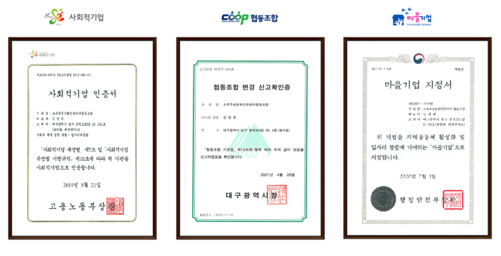
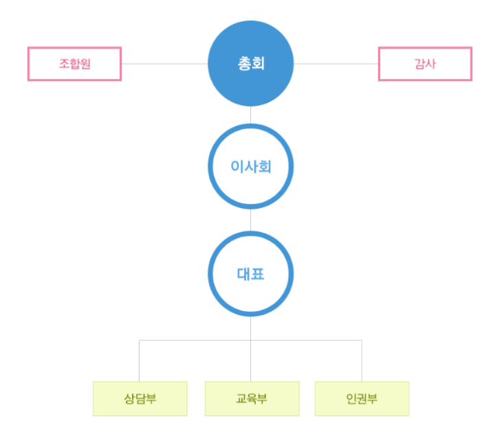
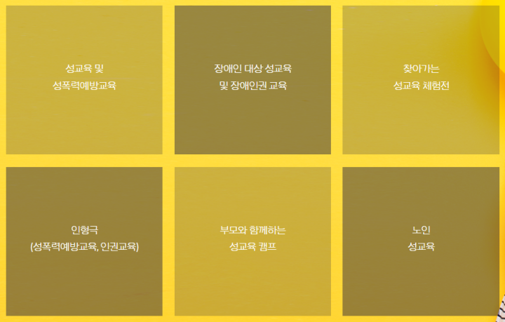
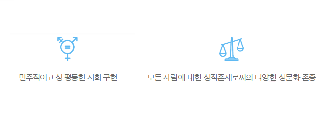
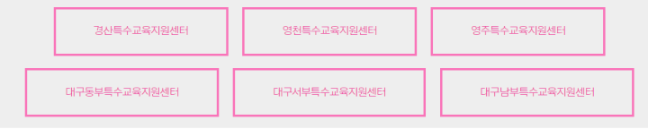

# 인증 현황

 

 

# 배경 및 비전

디지털시대가 되면서 성문화의 흐름이 달라졌고 우리는 끊임없이 성과 관련한 인권침해 문제들을 매일 마주하고 있습니다.  

여러 사건들을 통해 알려진 범죄의 가해자와 피해자의 다수가 청소년이라는 사실은 성·인권교육의 중요성을 다시 확인시켜 줍니다.  

 

소우주 성문화인권센터는 교육을 통해 성범죄, 차별, 혐오 등 여러 인권침해 상황속에서 

청소년들이 삶의 주체로서 책임 있는 선택을 할 수 있고 건강한 가치관을 확립하여 다양성을 수용· 존중하는 평등한 사회를 실현하고자 합니다.     

 

성 ·인권교육은 여러 교육기관, 특수교육청, 장애인 단체 등과 협업하여

강의, 토론, 체험, 인형극, 놀이활동 등 다양한 교수방식으로

대상의 개별 요구와 눈높이에 맞춰 맞춤식 프로그램으로 재구성, 진행하고 있습니다. 

그 외 다년간의 현장 경험 사례를 바탕으로 한 교사연수, 부모교육 및 장애인권(장애인식개선)교육 등이 이루어지고 있습니다.

 

# 조직도

 

 

# 사업내용

 

 

# 기관 철학

 

 

# 연대 및 협력기관

 

 